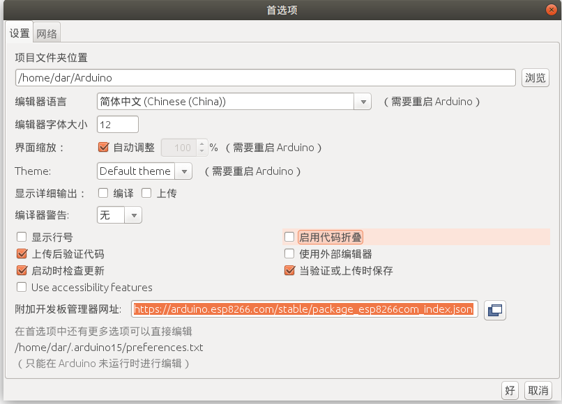
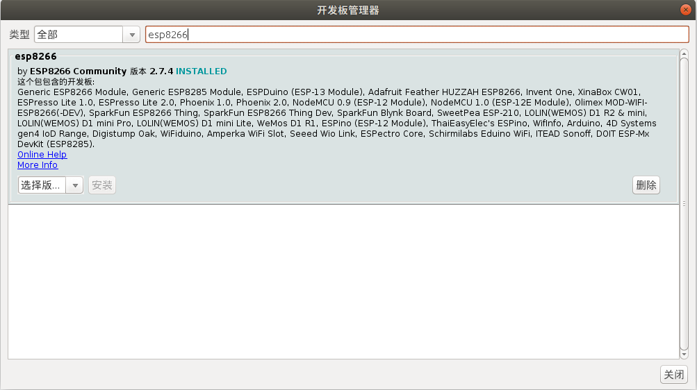
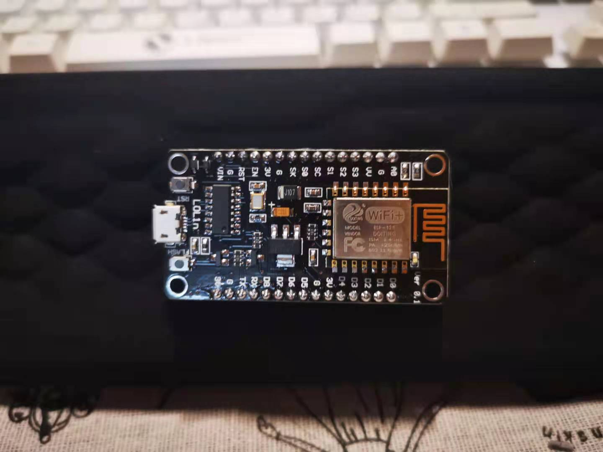
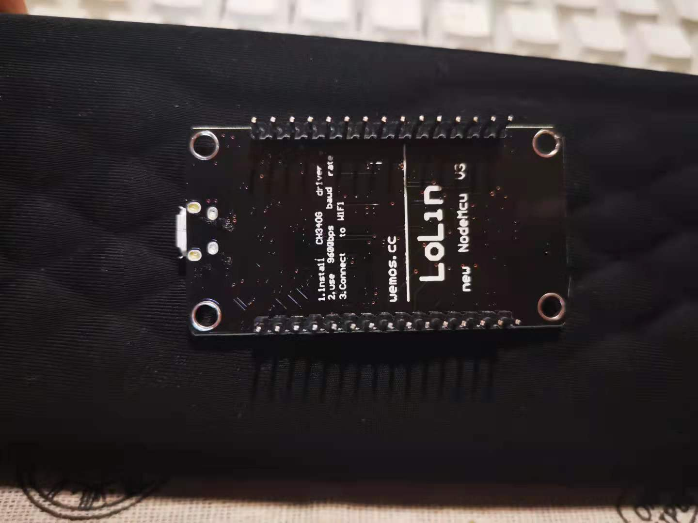
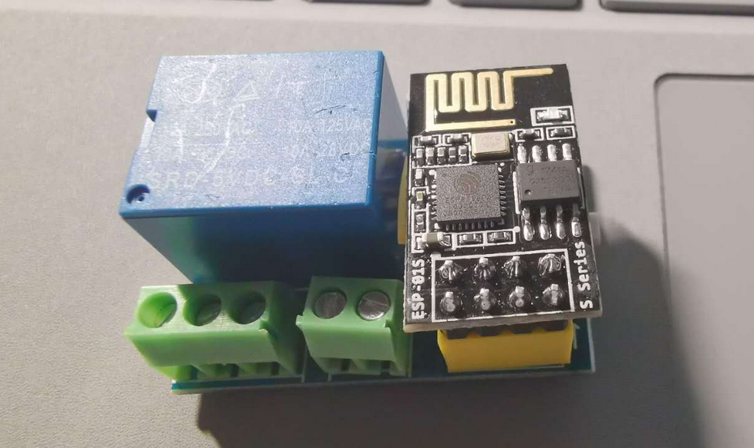
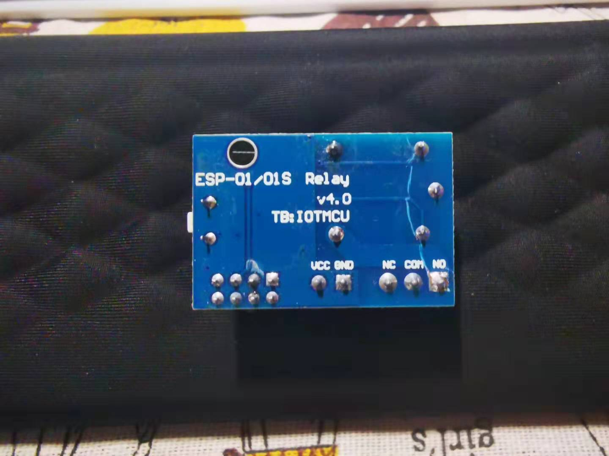

# ESP8266-MIOT

## 工程配置
1. 功能实现： 使用小爱同学控制 开关， 利用 esp8266的局域网功能， 控制 继电器吸合 ，实现 通断电路效果。

    需要 材料： esp8266-01s，继电器 5v， 下载器 ，小爱音响，Arduion IDE ，点灯科技 APP；

   **软件准备**

   - 安装 Arduion， 
   - 安装成功后 首选项中 修改 语言为中文，更改附加开发板管理网站``http://arduino.esp8266.com/stable/package_esp8266com_index.json``
   - 打开工具>开发板> 开发板管理工具 搜索esp8266 安装 最新；
   - 选择 对应端口 以及 开发板 GENERIC ESP8266 Module
   - 将git 克隆下来的 Blinker.7z 解压到 Arduion库文件夹中 
   - 即可选择对应开发板的.ino 文件打开

   参考资料 https://blog.csdn.net/weixin_38428827/article/details/107734697

2. 打开文件>首选项，更改附加开发板管理网址如下：http://arduino.esp8266.com/stable/package_esp8266com_index.json
  

3. 工具>开发板>开发板管理工具，搜索ESP8266，安装最新版
  

## Electric-Cooker 类型
- 电饭煲控制代码

  

  

## Delay 类型
- 继电器板控制代码

